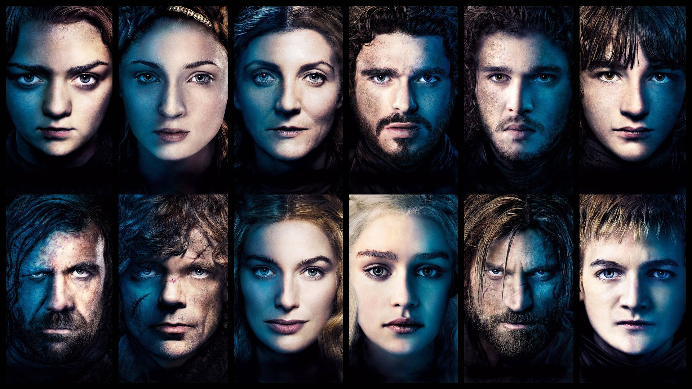

# Game of Thrones NLP-Neural Network Project



## Table of Content

* [Intro](#Intro)
* [Import Libraries](#Part-1-Import-Libraries)
* [Data Scraping](#Part-2-Scrape-the-Internet-for-List-of-All-Characters)
* [Set Up Data Sources](#Part-3-Acquire-and-Set-Up-the-Proper-Data-Sources)
* [Data Wrangling](#Part-4-Data-Cleaning-and-Preparation)
* [Visualization and Analysis](#Part-5-Visualization-and-Analysis)
* [Conclusions](#Conclusions)
* [Shortcomings and Potential Improvements](#Shortcomings-and-Potential-Improvements)

## Intro

A Song of Ice and Fire(ASOIAF) is the popular fantasy book series written by George R. R. Martin. 
The hit TV show "Game of Thrones" is based off this book series. 
ASOIAF is known for the abnormally large amount of characters and the lack of a singular protagonist and antagonist like in most shows and books.

Throughout this notebook, I will be using different techniques to do the following:
1) Scrape the ASOIAF wiki to get a list of all the Characters that have ever appeared in the book series
2) Use an NLP package to read through all the books and create associations between the characters
3) Use the NetworkX and Pyvis package to create networks between all the characters and create beautiful visuals

## Part 1 Import Libraries


```python
import pandas as pd
import numpy as np
import time
from selenium import webdriver
from selenium.webdriver.common.by import By
from selenium.webdriver.support.ui import WebDriverWait
from selenium.webdriver.support import expected_conditions as EC
from selenium.webdriver.common.action_chains import ActionChains
from webdriver_manager.chrome import ChromeDriverManager
import spacy
from spacy import displacy
import networkx as nx
import matplotlib.pyplot as plt
import os
import re
import pyvis
```

## Part 2 Scrape the Internet for List of All Characters


```python
driver = webdriver.Chrome()

# Navigate to the target page
url = "https://iceandfire.fandom.com/wiki/Category:Characters"
driver.get(url)
time.sleep(10)


# Create a list to store character names
character_names = []

# Create an infinite loop that keeps running until there is no longer a "Next" button to click
while True:
    # Wait for the character names to load on the page
    WebDriverWait(driver, 10).until(
        EC.presence_of_all_elements_located((By.CLASS_NAME, "category-page__member-link"))
    )

    # Extract and add the character names to the list
    names_elements = driver.find_elements(By.CLASS_NAME, "category-page__member-link")
    for element in names_elements:
        character_names.append(element.text)

    # Check if the "Next" button exists and is clickable
    try:
        # Use explicit wait to ensure the "Next" button is clickable
        next_button = WebDriverWait(driver, 10).until(
            EC.element_to_be_clickable((By.XPATH, "//a[contains(@class, 'category-page__pagination-next')]"))
        )

        # Scroll to the "Next" button and click it
        ActionChains(driver).move_to_element(next_button).perform()
        next_button.click()

        # Wait for the page to reload
        WebDriverWait(driver, 10).until(
            EC.staleness_of(names_elements[0])
        )
    except Exception as e:
        print("No more pages or unable to click 'Next'.", str(e))
        break

# Close the browser
driver.quit()

# Print the results
print(f"Total characters scraped: {len(character_names)}")
print(character_names)
```

    No more pages or unable to click 'Next'. Message: 
    Stacktrace:
    	GetHandleVerifier [0x00007FF6F40AAD22+56930]
    	(No symbol) [0x00007FF6F401F622]
    	(No symbol) [0x00007FF6F3ED42E5]
    	(No symbol) [0x00007FF6F3F198ED]
    	(No symbol) [0x00007FF6F3F19A2C]
    	(No symbol) [0x00007FF6F3F5A967]
    	(No symbol) [0x00007FF6F3F3BCDF]
    	(No symbol) [0x00007FF6F3F581E2]
    	(No symbol) [0x00007FF6F3F3BA43]
    	(No symbol) [0x00007FF6F3F0D438]
    	(No symbol) [0x00007FF6F3F0E4D1]
    	GetHandleVerifier [0x00007FF6F4426AAD+3709933]
    	GetHandleVerifier [0x00007FF6F447FFED+4075821]
    	GetHandleVerifier [0x00007FF6F447817F+4043455]
    	GetHandleVerifier [0x00007FF6F4149756+706710]
    	(No symbol) [0x00007FF6F402B8FF]
    	(No symbol) [0x00007FF6F4026AE4]
    	(No symbol) [0x00007FF6F4026C3C]
    	(No symbol) [0x00007FF6F40168F4]
    	BaseThreadInitThunk [0x00007FFEB08D257D+29]
    	RtlUserThreadStart [0x00007FFEB174AA58+40]
    
    Total characters scraped: 1469
    ['Addam Marbrand', 'Addison Hill', 'Adrack Humble', 'Adrian Tarbeck', 'Aegon Blackfyre', 'Aegon Frey', 'Aegon Frey (son of Aenys)', 'Aegon I Targaryen', 'Aegon II Targaryen', 'Aegon III Targaryen', 'Aegon IV Targaryen', 'Aegon Targaryen (Son of Aenys I)', 'Aegon Targaryen (son of Aerys II)', 'Aegon Targaryen (Son of Baelon)', 'Aegon Targaryen (son of Gaemon)', 'Aegon Targaryen (son of Jaehaerys I)', 'Aegon Targaryen (son of Rhaegar)', 'Aegor Rivers', 'Aelyx Targaryen', 'Aemma Arryn', 'Aemon (wildling)', 'Aemon Blackfyre', 'Aemon Targaryen (Son of Jaehaerys I)', 'Aemon Targaryen (Son of Maekar I)', 'Aemond Targaryen', 'Aenar Targaryen', 'Aenys Frey', 'Aerea Targaryen', 'Aerion Targaryen', 'Aerion Targaryen (son of Daemion)', 'Aeron Greyjoy', 'Aeryn Targaryen', 'Aerys Targaryen (son of Aegon)', 'Aethan Velaryon', 'Aethelmure', 'Aggo', 'Agnes Blackwood', 'Aladale Wynch', 'Aladore Florent', 'Alan Beesbury', "Alan o' the Oak", 'Alan Tarly', 'Alannys Harlaw', 'Alaric Stark', 'Alarra Massey', 'Alarra Stark', 'Alayaya', 'Alayne Royce', 'Albar Royce', 'Albett', 'Albin Massey', 'Alchemist', 'Alekyne Florent', 'Alerie Hightower', 'Alester Florent', 'Alester Norcross', 'Alester Oakheart', 'Alfyn', 'Alfyn (Septon)', 'Alicent Hightower', 'All-for-Joffrey', 'Allar', 'Allar Deem', 'Alleras', 'Alliser Thorne', 'Allyria Dayne', 'Alton Greyjoy', 'Alvyn Sharp', 'Alyce Graceford', 'Alyn', 'Alyn Blackwood', 'Alyn Bullock', 'Alyn Cockshaw', 'Alyn Connington', 'Alyn Frey', 'Alyn Haigh', 'Alyn Marbrand', 'Alyn Orkwood', 'Alyn Stackspear', 'Alyn Stokeworth', 'Alyn Tarbeck', 'Alys Beesbury', 'Alys Karstark', 'Alys Karstark (Wife of Brandon)', 'Alys Oakheart', 'Alys Rivers', 'Alys Stackspear', 'Alys Stark', 'Alysanne (daughter of Aegon IV)', 'Alysanne Blackwood', 'Alysanne Bracken', 'Alysanne Bulwer', 'Alysanne Farman', 'Alyssa Blackwood', 'Alyssa Targaryen', 'Alyssa Velaryon', 'Amarei Crakehall', 'Amerei Frey', 'Amory Lorch', 'Amos Bracken', 'Andar Royce', 'Andrey Charlton', 'Andrey Dalt', 'Andrik', 'Andros Brax', 'Androw Ashford', 'Androw Farman', 'Androw Frey', 'Anguy', 'Annara Farring', 'Antario Jast', 'Anya Waynwood', "Archon's Daughter (Jaehaerys I)", 'Ardrian Celtigar', 'Aregelle Stark', 'Areo Hotah', 'Argella Durrandon', 'Arianne Martell', 'Arlan of Pennytree', 'Armen', 'Armond Caswell', 'Aron Santagar', 'Arra Norrey', 'Arrana Stark', 'Arrec Durrandon', 'Arryk', 'Arryk Cargyll', 'Jon Arryn', 'Arsa Stark', 'Arstan Selmy', 'Arthur Dayne', 'Artos Flint', 'Artos Stark', 'Arwood Frey', 'Arwyn Frey', 'Arya Flint', 'Arya Stark', 'Arys Oakheart', 'Asha Greyjoy', 'Ashara Dayne', 'Aubrey Crakehall', 'Aurane Waters', 'Aurion', 'Axell Florent', 'Ayrmidon', 'Azor Ahai', 'Baelon Targaryen', 'Baelon Targaryen (son of Aerys)', 'Baelon Targaryen (son of Viserys I)', 'Baelor Blacktyde', 'Baelor I Targaryen', 'Balaq', 'Balerion Otherys', 'Balman Byrch', 'Balon Botley', 'Balon Swann', 'Balon Tawney', 'Balon V Greyjoy', 'Renly Baratheon', 'Barbara Bracken', 'Barbrey Dustin', 'Barneby', 'Barra', 'Barre', 'Barristan Selmy', 'Barthogan Stark', 'Bass', 'Category:Bastards', 'Bella', 'Bellanora Otherys', 'Bellegere Otherys', 'Bellegere Otherys (courtesan)', 'Bellena Hawick', 'Bellonara Otherys', 'Benard Brune', 'Benedict I Justman', 'Benedict II Justman', 'Benfred Tallhart', 'Benfrey Frey', 'Benifer', 'Benjen Stark', 'Benjen Stark (Lord)', 'Benjen Stark (Son of Bennard)', 'Benjicot Blackwood', 'Bennard Stark', 'Bennarion Botley', 'Bennifer Blackwood', 'Benton Glover', 'Beren Tallhart', 'Berena Hornwood', 'Beric Dondarrion', 'Bernarr II Justman', 'Beron Blacktyde', 'Beron Stark', 'Bertrand Tyrell', 'Bess Bracken', 'Beth Cassel', 'Bethany Blackwood', 'Bethany Bracken', 'Bethany Rosby', 'Bharbo', 'Big Belly Ben', 'Billy Burley', 'Biter', 'Black Maris', 'Blackshield', 'Blood (horse)', 'Ramsay Bolton', 'Boremund Harlaw', 'Boros Blount', 'Bors the Breaker', 'Borys Baratheon', 'Bowen Marsh', 'Bran Stark', 'Branda Stark', 'Brandon of the Bloody Blade', 'Brandon Stark (Father of Walton)', 'Brandon Stark (Son of Bennard)', 'Brandon Stark (Son of Cregan)', 'Brandon Stark (The Boisterous)', 'Brandon Tallhart', 'Braxton Beesbury', 'Brella', 'Brienne Tarth', 'Bronn', 'Brus Buckler', 'Bryan Frey', 'Bryce Caron', 'Bryen Caron', 'Brynden Blackwood', 'Brynden Rivers', 'Brynden Tully', 'Bryndon Hightower', 'Bump', 'Burton Crakehall', 'Burton Humble', 'Byan Votyris', 'Byron', 'Byron Swann', 'Cadwyl', 'Caleotte', 'Calla Blackfyre', "Captain's Sister", 'Cassana Estermont', 'Cassella Staunton', 'Catelyn Bracken', 'Catelyn Stark', 'Catspaw', 'Cayn', 'Cedric Payne', 'Cerelle Lannister', 'Cerenna Lannister', 'Cerissa Lannister', 'Cersei Lannister', 'Ceryse Hightower', 'Category:Characters from the Reach', 'Category:Characters from the Westerlands', 'Chataya', 'Chayle', 'Chett', 'Chiggen', 'Category:Children', 'Clarent Crakehall', 'Clayton Suggs', 'Clegane (Father of Gregor and Sandor)', 'Clement Piper', 'Cleos Frey', 'Cletus Yronwood', 'Cleyton Caswell', 'Clydas', 'Cohollo', 'Coldhands', 'Colemon', 'Colin Florent', 'Colmar Frey', 'Corlys Velaryon (brother of Aethan)', 'Coryanne Wylde', 'Craghorn Hoare', 'Crake the Boarkiller', 'Cregan Karstark', 'Cregan Stark', 'Cregard Stark', 'Creighton Longbough', 'Cressen', 'Creylen', 'Culiper', 'Cynthea Frey', 'Cyrelle Tarbeck', 'Cyrenna Swann', 'Daario Naharis', 'Dacey Mormont', 'Dacks', 'Daegon Shepherd', 'Daella Targaryen (daughter of Jaehaerys I)', 'Daella Targaryen (daughter of Maekar I)', 'Daemion Targaryen', 'Daemon Blackfyre', 'Daemon Targaryen', 'Daenerys I Targaryen', 'Daenerys Targaryen (daughter of Jaehaerys I)', 'Daenora Targaryen', 'Daenys Targaryen', 'Daeron II Targaryen', 'Daeron Targaryen (son of Aegon V)', 'Daeron Targaryen (son of Aerys II)', 'Daeron Targaryen (Son of Maekar I)', 'Daeron Targaryen (the Daring)', 'Daeryssa', 'Dagmer', 'Dagon Codd', 'Dagon Drumm', 'Dagon Greyjoy', 'Dagon Greyjoy (Drunkard)', 'Dale Drumm', 'Dalton Greyjoy', 'Damion Lannister', 'Damon Darry', 'Damon Lannister (lord)', 'Damon Lannister (son of Jason)', 'Damon Marbrand', 'Damon Morrigen', 'Damon Paege', 'Damon Shett', 'Danny Flint', 'Danos Slynt', 'Danwell Frey', 'Dareon', 'Darlessa Marbrand', 'Darnold Arryn', 'Daryn Hornwood', 'Daughter of the Dusk', 'Daven Lannister', 'Davos Baratheon', 'Davos Dayne', 'Davos Seaworth', 'Deana Hardyng', 'Category:Deceased Characters', 'Delena Florent', 'Denyo Terys', 'Denys Darklyn', 'Denys Drumm', 'Denys Swann', 'Desmera Redwyne', 'Desmond', 'Desmond Grell', 'Devan Seaworth', 'Deziel Dalt', 'Dick Follard', 'Dickon Frey', 'Dickon Morrigen', 'Dickon Tarly', 'Dobber', 'Donal Noye', 'Donel Greyjoy', 'Donella Hornwood', 'Donnel Drumm', 'Donnel Flint', 'Donnel Haigh', 'Donnel Hightower', 'Donnel of Duskendale', 'Donnel Waynwood', 'Donnis', 'Donnor Saltcliffe', 'Donnor Stark', 'Dontos Hollard', 'Doran Martell', 'Doreah', 'Dormund', 'Dorna Swyft', 'Category:Dragons', 'Drogo', 'Dryn', 'Duncan the Tall', 'Dunstan Drumm', 'Dunstan Pryor', 'Duram Bar Emmon', 'Durran', 'Durran II Durrandon', 'Durwald I Durrandon', 'Duskendale Captain', 'Dusky Woman', 'Dyanna Dayne', 'Dykk Harlaw', 'Dywen', 'Ebrose', 'Eddara Tallhart', 'Eddard Karstark', 'Eddard Stark', 'Eddison Tollett', 'Edgar Sloane', 'Edgerran Oakheart', 'Edmund Blackwood', 'Edmyn Tully', 'Edric Dayne', 'Edric Stark', 'Edric Stark (Son of Cregan)', 'Edwell Celtigar', 'Edwyle Stark', 'Edwyn Frey', 'Edyth', 'Eerl Harlaw', 'Elaena Targaryen (daughter of Gaemon)', 'Elder Brother', 'Eldred Codd', 'Eleyna Westerling', 'Elia Martell', 'Elinda Massey', 'Elinor Massey', 'Elinor Tyrell', 'Ella Broome', 'Ella Lannister', 'Ellard Crane', 'Ellard Stark', 'Ellaria Sand', 'Ellyn Ever Sweet', 'Ellyn Reyne', 'Elmar Frey', 'Elmo Tully', 'Elric Stark', 'Elwood Meadows', 'Elyas Scales', 'Elyn Norridge', 'Elys Arryn', 'Elys Waynwood', 'Elys Westerling', 'Elysar', 'Emberlei Frey', 'Emma', 'Emmett', 'Emmon Cuy', 'Emmon Frey', 'Emmond', 'Emory Hill', 'Endrew Tarth', 'Erena Glover', 'Erich Hoare', 'Erich I Greyiron', 'Erich V Harlaw', 'Erich VII Durrandon', 'Ermesande Hayford', 'Erren Florent', 'Erryk', 'Erryk Cargyll', 'Essie', 'Ethan Glover', 'Falena Stokeworth', 'Falyse Stokeworth', 'Fergon Hoare', 'Flement Brax', 'Fletcher Dick', 'Florian the Fool', 'Florys the Fox', 'Syrio Forel', 'Forley Prester', 'Foss the Archer', 'Franklyn Farman', 'Franklyn Flowers', 'Free Folk', 'Frenken', 'Gael Targaryen', 'Gaemon Palehair', 'Gaemon Targaryen (son of Aenar)', 'Gaemon Targaryen (son of Jaehaerys I)', 'Gage', 'Galbart Glover', 'Gared', 'Gareth Clifton', 'Gareth II Gardener', 'Garibald Grey', 'Garlan Tyrell', 'Garrison Prester', 'Garse Goodbrook', 'Garse VII Gardener', 'Garth Greenfield', 'Garth Greenhand', 'Garth the Gardener', 'Garth Tyrell', 'Gawen Glover', 'Gawen Westerling', 'Gawen Wylde', 'Gendry', 'Genna Lannister', 'Gerald Gower', 'Geremy Frey', 'Gerion Lannister', 'Germund Botley', 'Gerold III Lannister', 'Gerold Lannister', 'Gerold Templeton', 'Gerrick Kingsblood', "Gerrick Kingsblood's Youngest Daughter", 'Gevin Harlaw', 'Gilbert Farring', 'Gilbert of the Vines', 'Gilliane Glover', 'Gilly', "Gilly's son", 'Glendon Flowers', 'Godry Farring', 'Goren Greyjoy', 'Gormon Massey', 'Gormon Peake', 'Gormond Drumm', 'Gormond Goodbrother', 'Gorold Goodbrother', 'Gran Goodbrother', 'Grance Morrigen', 'Green Queen', 'Greenbeard', 'Gregor Clegane', 'Gregor Goode', 'Grenn', 'Grey King', 'Grey Kings', 'Grey Wind', 'Greydon Goodbrother', 'Balon IX Greyjoy', 'Euron III Greyjoy', 'Griffith Goode', 'Grover Tully', 'Guncer Sunglass', 'Gwayne Gaunt', 'Gwayne Hightower', 'Gwenys Rivers', 'Gwin Goodbrother', 'Gwynesse Harlaw', 'Gylbert Farman', 'Gylbert Farwynd', 'Gyldayn', 'Gyles Farwynd', 'Gyles II Gardener', 'Gyles Rosby', 'Gysella Goodbrother', 'Haegon Blackfyre', 'Haereg', 'Haggo', 'Haggon', 'Hagon Hoare', 'Hake', 'Hal (Hairy)', 'Halder', 'Qhorin', 'Hali', 'Halleck', 'Halleck Hoare', 'Hallis Hornwood', 'Hallis Mollen', 'Hallyne', 'Halys Hornwood', 'Hareth', 'Harlan Hoare', 'Harlon Botley', 'Harlon Greyjoy', 'Harlon the Hunter', 'Harma', 'Harmen Uller', 'Harmond Umber', 'Harmund I Hoare', 'Harmund II Hoare', 'Harmund III Hoare', 'Harmund Sharp', 'Harrag Hoare', 'Harrag Sharp', 'Harras Harlaw', 'Harras Hoare', 'Harren Botley', 'Harren Hoare', 'Harren the Red', 'Harrion Karstark', 'Harrold Hardyng', 'Harrold Langward', 'Harrold Rogers', 'Harrold Swyft', 'Harrold Westerling', 'Harron Harlaw', 'Harry Rivers', 'Harry Strickland', 'Harwin', 'Harwin Strong', 'Harwyn Hoare', 'Harys Haigh', 'Harys Horpe', 'Harys Swyft', 'Helman Tallhart', 'Hendry Bracken', 'Henly (Maester)', 'Herndon of the Horn', 'Herrock Kenning', 'Heward', 'Hibald', 'High Lickspittle', 'High Septon (Pater)', "High Septon (Tyrion's)", 'Gerold Hightower', 'Hilmar Drumm', 'Category:Historical characters', 'Hoarfrost Umber', 'Hobb', 'Hobber Redwyne', 'Hobert Hightower', 'Hodor', 'Hoke', 'Holly', 'Hop-Robin', 'Horas Redwyne', 'Horgan Hoare', 'Horton Redfort', 'Horys Hill', 'Hosman Norcross', 'Hosteen Frey', 'Hostella Frey', 'Hoster Blackwood', 'Hoster Frey', 'Hot Pie', 'Hotho Harlaw', 'Howard Bullock', 'Hubard Rambton', 'Hubert Arryn', 'Hugh', 'Hugh Clifton', 'Hugh Hammer', 'Hugo Wull', 'Hullen', 'Humfrey', 'Humfrey Beesbury', 'Humfrey Bracken', 'Humfrey Clifton', 'Humfrey Hardyng', 'Humfrey Swyft', 'Illifer', 'Illyrio Mopatis', 'Ilyn Payne', 'Imry Florent', 'Irri', 'Jacaerys Velaryon', 'Jacelyn Bywater', 'Jack Bulwer', 'Jack Musgood', 'Jacks', 'Jaehaerys I Targaryen', 'Jafer Flowers', 'Jaime Lannister', 'Jalabhar Xho', 'Jammos Frey', 'Janei Lannister', 'Janna Tyrell', 'Janos Slynt', "Jaqen H'ghar", 'Jared Frey', 'Jaremy Rykker', 'Jason Lannister', 'Jason Lannister (son of Gerold)', 'Jasper Waynwood', 'Jax', 'Jayne Bracken', 'Jennis Templeton', 'Jenye Westling', 'Jeren', 'Jeyne Beesbury', 'Jeyne Darry', 'Jeyne Farman', 'Jeyne Goodbrook', 'Jeyne Manderly', 'Jeyne Marbrand', 'Jeyne Poole', 'Jeyne Waters', 'Jeyne Westerling', 'Jeyne Westerling (Wife of Maegor I)', 'Jhiqui', 'Jhogo', 'Jirelle Mooton', 'Joanna Lannister', 'Joanna Swyft', 'Jocasta Lannister', 'Jocelyn Stark', 'Jocelyn Swyft', 'Joffrey Caswell', 'Joffrey I Baratheon', 'Joffrey Lannister', 'Joffrey Lonmouth', 'Johanna Westerling', 'John the Oak', 'Jojen Reed', 'Jommo', 'Jon Bettley', 'Jon Brax', 'Jon Brightstone', 'Jon Bulwer', 'Jon Cafferen', 'Jon Connington', 'Jon Florent', 'Jon Heddle', 'Jon Hogg', 'Jon Mooton', 'Jon Myre', 'Jon Penrose', 'Jon Piper', 'Jon Redfort', 'Jon Roxton', 'Jon Stark', 'Jon Umber (Greatjon)', 'Jon Umber (Husband of Serena)', 'Jon Waters', 'Jonah Mooton', 'Jonnel Stark', 'Jonos Arryn', 'Jonos Bracken', 'Jonos Frey', 'Jonothor Darry', 'Jonquil', 'Jonquil Darke', 'Joron I Blacktyde', 'Jorquen', 'Jory Cassel', 'Joseran', 'Joseth Mallister', 'Joss Stillwood', 'Josua Massey', 'Joy Hill', 'Joyeuse Erenford', 'Jurene', 'Justin Massey (Milk-Eye)', 'Jyck', 'Kaeth', 'Karlon Stark', 'Rickard Karstark', 'Karyl Vance', 'Kedge', 'Kegs', 'Kella', 'Kermit Tully', 'Kevan Lannister', 'Kezmya Pahl', 'Kindly Man', 'Category:Knights', 'Kurleket', 'Kyra', 'Kyra Frey', 'Laenor Velaryon', 'Lambert Turnberry', 'Lancel Lannister', 'Lanna Lannister', 'Tygett Lannister', 'Tyrek Lannister', 'Tytos Lannister', 'Tywin Lannister', 'Larence Snow', 'Lark', 'Larys Strong', 'Last hero', 'Last Lord Tarbeck', 'Laswell Peake', 'Leana Frey', 'Leathers', 'Lelia Lannister', 'Lem Lemoncloak', 'Lenwood Tawney', 'Leo Blackbar', 'Leo Tyrell (son of Moryn)', 'Leo Tyrell (son of Victor)', 'Leobald Tallhart', 'Leona Woolfield', 'Leonella Lefford', 'Leonette Fossoway', 'Leslyn Haigh', 'Lester', 'Lew', 'Lew (Winterfell Guard)', 'Lewys Lydden', 'Lewys Piper', 'Lharys', 'Lia Serry', 'Lianna Velaryon', 'Lily', 'Lodos (I)', 'Lodos (II)', 'Lomys', 'Lonnel Snow', 'Loras Tyrell', 'Lord Commander Hoare', 'Lord Commander Qorgyle', "Lord Commander's Raven", 'Lord Staunton (Father of Cassella)', 'Lord Sunglass', 'Lord Tarbeck (Son of Alyn)', 'Loren I Lannister', 'Lorence Roxton', 'Lorent Caswell', 'Lorent Lorch', 'Loreon I Lannister', 'Lorimar Peake', 'Lorimer', 'Loron Greyjoy', 'Loron Greyjoy (lord)', 'Lorra Royce', 'Lothar Bracken', 'Lothar Frey', 'Lothor Brune', 'Lucamore Strong', 'Lucas Blackwood', 'Lucas Codd', 'Lucas Corbray', 'Lucas Roote', 'Luceon Frey', 'Lucifer Hardy', 'Lucifer Justman', 'Lucifer Massey', 'Lucimore Botley', 'Lucinda Tully', 'Lucion Lannister', 'Luthor Tyrell', 'Luthor Tyrell (son of Moryn)', 'Luthor Tyrell (son of Theodore)', 'Luwin', 'Lyanna Mormont', 'Lyanna Stark', 'Lyanna Stark (Daughter of Cregan)', 'Lyarra Stark', 'Lyle Crakehall', 'Lyman Darry', 'Lyman Lannister', 'Lymond Goodbrook', 'Lymond Hightower', 'Lymond Mallister', 'Lymond Vikary', 'Lyn Corbray', 'Lynara Stark', 'Lynora Hill', 'Lyonce', 'Lyonel Baratheon', 'Lyonel Corbray', 'Lyonel Frey', 'Lyonel Strong', 'Lysa Arryn', 'Lysa Farman', 'Lysa Locke', 'Lysa Meadows', 'Lythene Frey', 'Mace Tyrell', 'Mad Huntsman', 'Maege Mormont', 'Maegelle Targaryen', 'Maegon Targaryen', 'Maekar I Targaryen', 'Maelor Targaryen', 'Maelys Blackfyre', 'Maia Stokeworth', 'Maldon Massey', 'Malegorn of Redpool', 'Malleon', 'Jason Mallister', 'Mallor the Dornishman', 'Mandon Moore', 'Manfred Dondarrion', 'Manfred Swann', 'Manfrey Martell', 'Manfryd Merlyn', 'Manfryd Mooton', 'Manfryd Redwyne', 'Manfryd Yew', 'Manly Stokeworth', 'Margaret Karstark', 'Marghaz zo Loraq', 'Margot Lannister', 'Mariah Stark', 'Marillion', 'Maris the Maid', 'Mariya Darry', 'Mark Mullendore', 'Marla Prester', 'Marlon Manderly', 'Marna Locke', 'Maron Botley', 'Maron Greyjoy', 'Maron Volmark', 'Marq Farman', 'Marq Piper', 'Marqelo Tagaros', 'Marsella Waynwood', 'Lewyn Martell', 'Mors Martell', 'Martyn Cassel', 'Martyn Lannister', 'Martyn Mullendore', 'Martyn Rivers', 'Maryam', 'Masha Heddle', 'Maslyn', 'Matarys Targaryen', 'Mathis Frey', 'Mathis Rowan', 'Matthar', 'Mattheus', 'Matthew Mullendore', 'Medgar Tully', 'Medrick', 'Medwick Tyrell', 'Meera Reed', 'Megga Tyrell', 'Meha', 'Melantha Blackwood', 'Melara Crane', 'Meldred Merlyn', 'Melesa Crakehall', 'Melessa Florent', 'Melisandre', 'Melissa Blackwood', 'Mellario of Norvos', 'Melony Piper', 'Melwyn Sarsfield', 'Merianne Frey', 'Meribald', 'Merlon Crakehall', 'Mern IX Gardener', 'Merrell Bullock', 'Merrell Florent', 'Merrett Frey', 'Mervyn Flowers', 'Meryn Trant', 'Mikken', 'Mina Tyrell', 'Minisa Tully', 'Mirri Maz Duur', 'Mohor', 'Mollander', 'Category:Monarchs', 'Moon (Septon)', 'Moon Boy', 'Mord', 'Mordane', 'Moreo Tumitis', 'Morgan Dunstable', 'Morgan Hightower', 'Morgan Wylde', 'Morgarth', 'Morgon Banefort', 'Jeor Mormont', 'Jorah Mormont', 'Moro', 'Morrec', 'Morros Slynt', 'Mors II Martell', 'Morya Frey', 'Mullin', 'Mully', 'Munda', 'Murenmure', 'Mya Rivers', 'Mycah', 'Mychel Redfort', 'Myles', 'Myles Mooton', 'Myles Toyne', 'Myranda Lefford', 'Myrcella Baratheon', 'Myriame Manderly', 'Myrielle Lannister', 'Mysaria', 'Naerys Targaryen', 'Naggle', 'Narha Otherys', "Night's King", 'Norbert Vance', 'Norjen', 'Norman Hightower', 'Normund', 'Norne Goodbrother', 'Norren', 'Notch', 'Nute the Barber', 'Nymeria', 'Nymeria Sand', 'Obara Sand', 'Oberyn Martell', 'Old Nan', 'Olene Tyrell', 'Olenna Tyrell', 'Ollidar', 'Olymer Tyrell', 'Olyvar Frey', 'Olyvar Yronwood', 'Olyver Bracken', 'Omer Blackberry', 'Omer Florent', 'Ondrew Locke', 'Orbert Caswell', 'Ormond Westerling', 'Ormund Baratheon', 'Ormund Hightower', 'Orryn Baratheon', 'Orton Merryweather', 'Orys Baratheon', 'Osbert Serry', 'Oscar Tully', 'Osfryd Kettleblack', 'Osha', 'Osmund Kettleblack', 'Osmund Strong', 'Osney Kettleblack', 'Osric Stark', 'Osric Umber', 'Oswald Wode', 'Oswell Whent', 'Oswyck', 'Oswyn', 'Othell Yarwyck', 'Othgar Hoare (the Demonlover)', 'Othgar Hoare (the Soulless)', 'Otho Bracken', 'Othor', 'Ottyn Wythers', 'Owen Costayne', 'Owen Oakenshield', 'Oznak zo Pahl', 'Patchface', 'Pate', 'Pate of Longleaf', 'Pate of the Blue Fork', 'Pate the Woodcock', 'Patrek Mallister', 'Paxter Redwyne', 'Penny Jenny', 'Perceon III Gardener', 'Peremore Hightower', 'Perianne Moore', 'Perkin Follard', 'Perra Royce', 'Perriane Frey', 'Perwyn Frey', 'Petyr Baelish', 'Petyr Frey', 'Petyr Piper', 'Philip Foote', 'Plummer', 'Podrick Payne', 'Polliver', 'Porther', 'Category:POV Character', 'Praed', 'Prentys Tully', 'Preston Greenfield', 'Prince that was Promised', 'Prudence Celtigar', 'Prunella Celtigar', 'Puckens', 'Pyat Pree', 'Pycelle', 'Pyg', 'Pypar', 'Qalen', 'Qarl Corbray', 'Qarl Correy', 'Qarl Kenning', 'Qarl Shepherd', 'Qarl the Maid', 'Qarlton II Durrandon', 'Qhored I Hoare', 'Qhorin Volmark', 'Qhorwyn Hoare', 'Qotho', 'Quaithe', 'Quaro', 'Quellon Botley', 'Quellon Greyjoy', 'Quellon Humble', 'Quenten Banefort', 'Quentin Tyrell', 'Quenton Greyjoy', 'Quenton Greyjoy (cousin)', 'Quentyn Ball', 'Quentyn Blackwood', 'Quentyn Martell', 'Quincy Cox', 'Qyburn', 'Qyle', 'Ragged Ralf', 'Rakharo', 'Ralf Kenning', 'Ralf Stonehouse', 'Rast', 'Ravos Hoare', 'Raya Stark', 'Mance Rayder', 'Raylon Rivers', 'Raymont Baratheon', 'Raymun Darry', 'Raymun Redbeard', 'Raymund Frey', 'Raymund Mallery', 'Raymund Tyrell', 'Raynald Westerling', 'Raynard Ruttiger', 'Red Oarsman', 'Red Princes', 'Howland Reed', 'Category:Reference Characters', 'Regenard Estren', 'Regis Groves', 'Regnar Drumm', 'Renfred Rykker', 'Renly Norcross', 'Rennifer Longwaters', 'Reynard Reyne', 'Reysen', 'Rhae Targaryen', 'Rhaegal', 'Rhaegal I Targaryen', 'Rhaegar Frey', 'Rhaegel Targaryen', 'Rhaella Targaryen', 'Rhaelle Targaryen', 'Rhaenyra Targaryen', 'Rhalla Targaryen', 'Rhea Florent', 'Rhea Royce', 'Rhogoro', 'Ricasso', 'Richard Horpe', 'Richard Roote', 'Rickard Redwyne', 'Rickard Stark', 'Rickard Stark (king)', 'Rickard Thorne', 'Rickard Tyrell', 'Rickon Stark', 'Rickon Stark (Son of Benjen)', 'Rickon Stark (Son of Cregan)', 'Rob the Starvling', 'Robar Royce', 'Robard Cerwyn', 'Robb Reyne', 'Robb Rivers', 'Robb Stark', 'Robert Arryn', 'Robert Ashford', 'Robert Blackwood', 'Robert Blackwood (209)', 'Robert Brax', 'Robert Brax (son of Flement)', 'Robert Frey (son of Rhaegar)', 'Robert I Baratheon', 'Robert Reyne', 'Robert Strong', 'Robett Glover', 'Robin Darklyn', 'Robin Greyjoy', 'Robin Massey', 'Robin Ryger', 'Robyn Ryswell', 'Roderick Blackwood', 'Roderick Dustin', 'Roderick Stark', 'Rodrik Cassel', 'Rodrik Greyjoy', 'Rodrik Harlaw', 'Rodrik Sparr', 'Rodrik Stark', 'Rodwell Stark', 'Roger Corne', 'Roger of Pennytree', 'Roger Reyne', 'Rognar II Greyiron', 'Rohanne Tarbeck', 'Rohanne Webber', 'Roland Crakehall', 'Roland Crakehall (Kingsguard)', 'Roland I Arryn', 'Roland Westerling', 'Rolder', 'Rollam Westerling', 'Rolland Darklyn', 'Rolland Longthorpe', 'Rolley of Sisterton', 'Rolly Duckfield', 'Rolph Spicer', 'Romny Weaver', 'Ronel Rivers', 'Ronnal Baratheon', 'Ronnel Arryn (king)', 'Roone', 'Roose Bolton', 'Rorge', 'Roryn Drumm', 'Rosamund Ball', 'Rosamund Lannister', 'Rose of Red Lake', 'Rosey', 'Rosey (daughter of Aegon IV)', 'Roslin Tully', 'Rowan Gold-Tree', 'Roy Connington', 'Royce Blackwood', 'Rufus Leek', 'Rupert Brax', 'Rus', 'Russell Merryweather', 'Ryam Florent', 'Rycherd Crane', 'Ryella Frey', 'Ryella Royce', 'Ryk', 'Rylene Florent', 'Ryman Frey', 'Rymolf', 'Rymond Arryn', 'Salladhor Saan', 'Sabitha Frey', 'Sallei Paege', 'Samantha Stokeworth', 'Samgood of Sour Hill', 'Samwell Blackwood', 'Samwell Dayne', 'Samwell Rivers', 'Samwell Spicer', 'Samwell Stokeworth', 'Samwell Tarly', 'Sandor Clegane', 'Sansa Stark', 'Sansa Stark (Daughter of Rickon)', 'Sara Snow', 'Saranella', 'Sargon Botley', 'Sarra Stark', 'Sarya Whent', 'Satin', 'Sawane Botley', 'Scarb', 'Sebaston Farman', 'Selmond Stackspear', 'Lyonel Selmy', 'Selyse Florent', 'Senelle', 'Serena Stark', 'Serra', 'Serwyn', 'Shadrich', 'Shae', 'Shaena Targaryen', 'Shagwell', 'She-Wolves', 'Shella Whent', 'Shiera Blackwood', 'Shiera Crakehall', 'Shiera Seastar', 'Shierle Swyft', 'Shireen Baratheon', 'Shirei Frey', 'Shortear', 'Shrike', 'Shrykos', 'Sigfry Stonetree', 'Sigfryd Harlaw', 'Sigorn', 'Simon Dondarrion', 'Simon Staunton (Squire)', 'Simon Strong', 'Skahaz mo Kandaq', 'Skinchangers', 'Small Paul', 'Smike', 'Smiling Knight', 'Spotted Pate', 'Stafford Lannister', 'Stallion Who Mounts the World', 'Stannis Baratheon', 'Brandon Stark', 'Steffarion Sparr', 'Steffon Baratheon', 'Steffon Darklyn', 'Steffon Fossoway', 'Steffon Frey', 'Steffon Stackspear', 'Steffon Swyft', 'Stevron Frey', 'Stiv', 'Lollys Stokeworth', 'Mya Stone', 'Edric Storm', 'Sumner Crakehall', 'Surly lad', 'Sybell Spicer', 'Sylas Flatnose', 'Sylvenna Sand', 'Sylwa Paege', 'Symond Botley', 'Symond Frey', 'Symond Templeton', 'Taena Merryweather', 'Talbert Serry', 'Talla Tarly', 'Tanda Stokeworth', 'Rhaegar Targaryen', 'Tarle', 'Randyll Tarly', 'Selwyn Tarth', 'Teora Kyndall', 'Ternesio Terys', 'Tess', 'The Sparr', 'The Stonehouse', 'Theo Charlton', 'Theo Wull', 'Theodore Tyrell', 'Theomore', 'Theomore Harlaw', 'Theon Greyjoy', 'Thoren Smallwood', 'Thoros of Myr', 'Three-Eyed Crow', 'Timeon', 'Timotty Snow', 'Tion Frey', 'Tion Lannister', 'Tion Tarbeck', 'Titus Peake', 'Tobho Mott', 'Todder', 'Todric', 'Togarion Bar Emmon', 'Tom Codd', 'Tom Costayne', 'Tom Flowers', 'Tom of Sevenstreams', 'Tomard', 'Tommen Costayne', 'Tommen I Baratheon', 'Tommen I Lannister', 'Tommen II Lannister', 'Tommen Tully', 'Torghen Flint', 'Torgon Greyiron', 'Torrhen Karstark', 'Torrhen Stark (Son of Edric)', 'Torwyn Greyjoy', 'Torwynd', 'Simon Toyne', 'Tregar', 'Tristifer Botley', 'Triston Farwynd', 'Triston Massey', 'Triston of Tally Hill', 'Trystane Martell', 'Edmure Tully', 'Hoster Tully', 'Turnip', 'Tyana Wylde', 'Tybolt Crakehall', 'Tybolt Lannister', 'Tyene Sand', 'Tyler Hill', 'Margaery Tyrell', 'Tyrion Lannister', 'Tyrion Tanner', 'Tysane Frey', 'Tysha', 'Tyta Frey', 'Tytos Blackwood', 'Tytos Brax', 'Tywald Lannister', 'Tywin Frey', 'Ulf the White', 'Uller', 'Umfred', 'Umma', 'Urragon III Greyiron', 'Urragon IV Greyiron', 'Urras Greyiron', 'Urrathon IV Goodbrother', 'Urrigon Greyjoy', 'Urron Greyiron', 'Urswyck', 'Uther Peake', 'Utherydes Wayn', 'Uthor of the High Tower', 'Utt', 'Vaegon Targaryen', 'Vaellyn', 'Valaena Velaryon', 'Valerion Targaryen', 'Varamyr', 'Vardis Egen', 'Vargo Hoat', 'Varly', 'Varys', 'Vayon Poole', 'Veron Greyjoy', 'Vickon Botley', 'Victaria Tyrell', 'Victarion Greyjoy', 'Victor the Valiant', 'Victor Tyrell', 'Visenya Targaryen', 'Viserra Targaryen', 'Viserys II Targaryen', 'Viserys III Targaryen', 'Viserys Targaryen (Son of Aenys I)', 'Vorian Dayne', 'Vortimer Crane', 'Waif', 'Walda Frey (daughter of Lothar)', 'Walda Frey (daughter of Merrett)', 'Walda Frey (daughter of Rhaegar)', 'Walda Frey (daughter of Walton)', 'Walder Brax', 'Walder Frey', 'Walder Frey (Black)', 'Walder Frey (son of Emmon)', 'Walder Frey (son of Jammos)', 'Walder Frey (son of Merrett)', 'Walder Goodbrook', 'Walder Haigh', 'Walder Rivers', 'Walderan Tarbeck', 'Waldon Wynch', 'Walgrave', 'Wallace Massey', 'Wallen', 'Walter Whent', 'Walter Wyl', 'Walton Frey', 'Walton Stark (Son of Brandon)', 'Walton Towers', 'Waltyr Frey', 'Walys Mooton', 'Watt of Long Lake', 'Waymar Royce', 'Wayn', 'Weeper', 'Wendamyr', 'Wendel Frey', 'Wendel Manderly', 'Wex Pyke', 'Whalen Frey', 'Wick Whittlestick', 'Will', 'Will Humble', 'Willamen Frey', 'Willas Tyrell', 'Willem Darry', 'Willem Frey', 'Willem Lannister', 'William Mooton', 'Willis Wode', 'Willow (daughter of Aegon IV)', 'Wineseller', 'Woth', 'Wulfgar Hoare', 'Wyl of Wyl', 'Wylis Manderly', 'Wylla', 'Wylla Fenn', 'Wylla Manderly', 'Wyman Manderly', 'Wynafrei Whent', 'Wynafryd Manderly', 'Wynton Stout', 'Xaro Xhoan Daxos', 'Yandry', 'Ygon Farwynd', 'Ygritte', 'Yohn Farwynd', 'Yohn Royce', 'Yorbert Royce', 'Yoren', 'Yorko Terys', 'Ysabel', 'Ysilla', 'Ysilla Royce', 'Zollo']
    

## Part 3 Acquire and Set Up the Proper Data Sources


```python
# Set up Named Entity Recognition

NER = spacy.load("en_core_web_sm")
```


```python
# Load the books

books = [b for b in os.scandir('C:/Users/Kinan Touma/Documents/Portfolio Projects/Game of Thrones/books') if '.txt' in b.name]
```


```python
# Define a function to see how many characters are in a book

def count_characters_in_file(file_path):
    char_count = 0
    with open(file_path, 'r', encoding='utf-8') as file:
        for chunk in iter(lambda: file.read(1024 * 1024), ''):
            char_count += len(chunk)
    return char_count

file_path = 'C:/Users/Kinan Touma/Documents/Portfolio Projects/Game of Thrones/books/1-A-Game-of-Thrones.txt'
total_characters = count_characters_in_file(file_path)
print(f'Total characters in file: {total_characters}')
```

    Total characters in file: 1608558
    

### Instead of a for loop that will loop through each book and create one dataframe, I opted to create a separate df for each book and then combine them later on.

#### The reason for this is two-fold:
#### 1) The process of parsing through all 5 books in one go takes a lot of time and is prone to breaking
#### 2) This way allows for both separate analysis of each book and an aggregated analysis of all the books together


```python
# Create a variable for each book

book1 = 'C:/Users/Kinan Touma/Documents/Portfolio Projects/Game of Thrones/books/1-A-Game-of-Thrones.txt'
book2 = 'C:/Users/Kinan Touma/Documents/Portfolio Projects/Game of Thrones/books/2-A-Clash-of-Kings.txt'
book3 = 'C:/Users/Kinan Touma/Documents/Portfolio Projects/Game of Thrones/books/3-A-Storm-of-Swords.txt'
book4 = 'C:/Users/Kinan Touma/Documents/Portfolio Projects/Game of Thrones/books/4-A-Feast-for-Crows.txt'
book5 = 'C:/Users/Kinan Touma/Documents/Portfolio Projects/Game of Thrones/books/5-A-Dance-With-Dragons.txt'

book_list = [book1, book2, book3, book4, book5]
```


```python
# Define a max length equal to the length of all characters for each book for the NER

book_counts = []

for book in book_list:
    total_characters = count_characters_in_file(book)
    print(f'Total characters in file: {total_characters}')
    book_counts.append(total_characters)
                
book_counts

# Set the max length of the NER method equals to the characters of the longest book to be on the safe side

NER.max_length = max(book_counts)
```

    Total characters in file: 1608558
    Total characters in file: 1764559
    Total characters in file: 2300382
    Total characters in file: 1672029
    Total characters in file: 2317690
    


```python
# For loop to read the text for each book and save it as an NER doc

book_docs = []

for book in book_list:
    with open(book, 'r', encoding='utf-8') as file:
        book_text = file.read()
    book_doc = NER(book_text)
    book_docs.append(book_doc)
```

## Part 4 Data Cleaning and Preparation


```python
# Create a dataframe with all the character names
character_df = pd.DataFrame(character_names, columns = ['character'])

# Substitute any awkward characters
character_df['character'] = character_df['character'].apply(lambda x: re.sub("[\(].*?[\)]", "",x))
```


```python
# Create a column that only has first names of characters
character_df['character_firstname'] = character_df['character'].apply(lambda x: x.split(' ',1)[0])
```


```python
# Create a variable for each book's NER doc to be able to call them easier

book1_doc = book_docs[0]
book2_doc = book_docs[1]
book3_doc = book_docs[2]
book4_doc = book_docs[3]
book5_doc = book_docs[4]
```


```python
# Parse through each sentence and get all the named entities and store into a list
# Do this one book at a time as this is the part that takes a long time and is prone to breaking the longer it goes
# Book 1

sent_entity_lists_book1 = []

for sent in book1_doc.sents:
    entity_list = [ent.text for ent in sent.ents]
    sent_entity_lists_book1.append({"sentence":sent.text, "entities": entity_list})
```


```python
# Book 2

sent_entity_lists_book2 = []

for sent in book2_doc.sents:
    entity_list = [ent.text for ent in sent.ents]
    sent_entity_lists_book2.append({"sentence":sent.text, "entities": entity_list})
```


```python
# Book 3

sent_entity_lists_book3 = []

for sent in book3_doc.sents:
    entity_list = [ent.text for ent in sent.ents]
    sent_entity_lists_book3.append({"sentence":sent.text, "entities": entity_list})
```


```python
# Book 4

sent_entity_lists_book4 = []

for sent in book4_doc.sents:
    entity_list = [ent.text for ent in sent.ents]
    sent_entity_lists_book4.append({"sentence":sent.text, "entities": entity_list})
```


```python
# Book 5

sent_entity_lists_book5 = []

for sent in book5_doc.sents:
    entity_list = [ent.text for ent in sent.ents]
    sent_entity_lists_book5.append({"sentence":sent.text, "entities": entity_list})
```


```python
# Create a data frame for each book

sent_entity_df_book1 = pd.DataFrame(sent_entity_lists_book1)
sent_entity_df_book2 = pd.DataFrame(sent_entity_lists_book2)
sent_entity_df_book3 = pd.DataFrame(sent_entity_lists_book3)
sent_entity_df_book4 = pd.DataFrame(sent_entity_lists_book4)
sent_entity_df_book5 = pd.DataFrame(sent_entity_lists_book5)

# Combine all the dataframes into one

combined_df = pd.concat([sent_entity_df_book1,
                         sent_entity_df_book2,
                         sent_entity_df_book3,
                         sent_entity_df_book4,
                         sent_entity_df_book5],
                        ignore_index = True)
combined_df
```


<div>
<style scoped>
    .dataframe tbody tr th:only-of-type {
        vertical-align: middle;
    }

    .dataframe tbody tr th {
        vertical-align: top;
    }

    .dataframe thead th {
        text-align: right;
    }
</style>
<table border="1" class="dataframe">
  <thead>
    <tr style="text-align: right;">
      <th></th>
      <th>sentence</th>
      <th>entities</th>
    </tr>
  </thead>
  <tbody>
    <tr>
      <th>0</th>
      <td>A Game of Thrones\n\n\nA Song of Ice and Fire\n\n</td>
      <td>[]</td>
    </tr>
    <tr>
      <th>1</th>
      <td>Book I\n\n\nGeorge R.R. Martin\n\n\n\n\n\nCont...</td>
      <td>[George R.R. Martin, South, Bran\n\nSansa\n\nD...</td>
    </tr>
    <tr>
      <th>2</th>
      <td>“The wildlings are dead.”\n\n“Do the dead frig...</td>
      <td>[]</td>
    </tr>
    <tr>
      <th>3</th>
      <td>Ser Waymar Royce asked with just the hint of a...</td>
      <td>[Waymar Royce]</td>
    </tr>
    <tr>
      <th>4</th>
      <td>Gared did not rise to the bait.</td>
      <td>[Gared]</td>
    </tr>
    <tr>
      <th>...</th>
      <td>...</td>
      <td>...</td>
    </tr>
    <tr>
      <th>145605</th>
      <td>He has written fantasy, horror, and science fi...</td>
      <td>[ten years, Hollywood, The Twilight Zone, Beau...</td>
    </tr>
    <tr>
      <th>145606</th>
      <td>In the mid ’90s he returned to prose, his firs...</td>
      <td>[the mid ’90s, first, A Song of Ice and Fire]</td>
    </tr>
    <tr>
      <th>145607</th>
      <td>He has been in the Seven Kingdoms ever since.</td>
      <td>[Seven]</td>
    </tr>
    <tr>
      <th>145608</th>
      <td>Whenever he’s allowed to leave, he returns to ...</td>
      <td>[Santa Fe, New Mexico, Parris, four]</td>
    </tr>
    <tr>
      <th>145609</th>
      <td>www.georgerrmartin.com\n\n\n\n\n\n</td>
      <td>[]</td>
    </tr>
  </tbody>
</table>
<p>145610 rows × 2 columns</p>
</div>


```python
# Function to filter out non-character entities

def filter_entity(ent_list, character_df):
    return [ent for ent in ent_list
            if ent in list(character_df['character'])
            or ent in list(character_df['character_firstname'])]

combined_df['character_entities'] = combined_df['entities'].apply(lambda x: filter_entity(x, character_df))
```


```python
# Filter out sentences that dont have any character entities

combined_df_filtered = combined_df[combined_df['character_entities'].map(len) > 0]
combined_df_filtered.head(10)
```


<div>
<style scoped>
    .dataframe tbody tr th:only-of-type {
        vertical-align: middle;
    }

    .dataframe tbody tr th {
        vertical-align: top;
    }

    .dataframe thead th {
        text-align: right;
    }
</style>
<table border="1" class="dataframe">
  <thead>
    <tr style="text-align: right;">
      <th></th>
      <th>sentence</th>
      <th>entities</th>
      <th>character_entities</th>
    </tr>
  </thead>
  <tbody>
    <tr>
      <th>3</th>
      <td>Ser Waymar Royce asked with just the hint of a...</td>
      <td>[Waymar Royce]</td>
      <td>[Waymar Royce]</td>
    </tr>
    <tr>
      <th>4</th>
      <td>Gared did not rise to the bait.</td>
      <td>[Gared]</td>
      <td>[Gared]</td>
    </tr>
    <tr>
      <th>9</th>
      <td>“What proof have we?”\n\n“Will saw them,” Gare...</td>
      <td>[Gared]</td>
      <td>[Gared]</td>
    </tr>
    <tr>
      <th>20</th>
      <td>Ser Waymar Royce glanced at the sky with disin...</td>
      <td>[Waymar Royce]</td>
      <td>[Waymar Royce]</td>
    </tr>
    <tr>
      <th>22</th>
      <td>Are you unmanned by the dark, Gared?”\n\nWill ...</td>
      <td>[Gared, Gared]</td>
      <td>[Gared, Gared]</td>
    </tr>
    <tr>
      <th>43</th>
      <td>Ser Waymar Royce was the youngest son of an an...</td>
      <td>[Waymar Royce]</td>
      <td>[Waymar Royce]</td>
    </tr>
    <tr>
      <th>45</th>
      <td>Mounted on his huge black destrier, the knight...</td>
      <td>[Gared]</td>
      <td>[Gared]</td>
    </tr>
    <tr>
      <th>47</th>
      <td>Ser Waymar had been a Sworn Brother of the Nig...</td>
      <td>[Waymar, the Night’s Watch, less than half]</td>
      <td>[Waymar]</td>
    </tr>
    <tr>
      <th>54</th>
      <td>“Mormont said as we should track them, and we ...</td>
      <td>[Mormont, Gared]</td>
      <td>[Gared]</td>
    </tr>
    <tr>
      <th>102</th>
      <td>Frostfallen leaves whispered past them, and Ro...</td>
      <td>[Royce]</td>
      <td>[Royce]</td>
    </tr>
  </tbody>
</table>
</div>


```python
# Take only first name of characters

combined_df_filtered['character_entities'] = combined_df_filtered['character_entities'].apply(lambda x: [item.split()[0] for item in x])
combined_df_filtered
```

    C:\Users\Kinan Touma\AppData\Local\Temp\ipykernel_70932\1214904854.py:3: SettingWithCopyWarning: 
    A value is trying to be set on a copy of a slice from a DataFrame.
    Try using .loc[row_indexer,col_indexer] = value instead
    
    See the caveats in the documentation: https://pandas.pydata.org/pandas-docs/stable/user_guide/indexing.html#returning-a-view-versus-a-copy
      combined_df_filtered['character_entities'] = combined_df_filtered['character_entities'].apply(lambda x: [item.split()[0] for item in x])
    


<div>
<style scoped>
    .dataframe tbody tr th:only-of-type {
        vertical-align: middle;
    }

    .dataframe tbody tr th {
        vertical-align: top;
    }

    .dataframe thead th {
        text-align: right;
    }
</style>
<table border="1" class="dataframe">
  <thead>
    <tr style="text-align: right;">
      <th></th>
      <th>sentence</th>
      <th>entities</th>
      <th>character_entities</th>
    </tr>
  </thead>
  <tbody>
    <tr>
      <th>3</th>
      <td>Ser Waymar Royce asked with just the hint of a...</td>
      <td>[Waymar Royce]</td>
      <td>[Waymar]</td>
    </tr>
    <tr>
      <th>4</th>
      <td>Gared did not rise to the bait.</td>
      <td>[Gared]</td>
      <td>[Gared]</td>
    </tr>
    <tr>
      <th>9</th>
      <td>“What proof have we?”\n\n“Will saw them,” Gare...</td>
      <td>[Gared]</td>
      <td>[Gared]</td>
    </tr>
    <tr>
      <th>20</th>
      <td>Ser Waymar Royce glanced at the sky with disin...</td>
      <td>[Waymar Royce]</td>
      <td>[Waymar]</td>
    </tr>
    <tr>
      <th>22</th>
      <td>Are you unmanned by the dark, Gared?”\n\nWill ...</td>
      <td>[Gared, Gared]</td>
      <td>[Gared, Gared]</td>
    </tr>
    <tr>
      <th>...</th>
      <td>...</td>
      <td>...</td>
      <td>...</td>
    </tr>
    <tr>
      <th>145582</th>
      <td>IN OLD VOLANTIS\n\n\n\n\n\nthe reigning triarc...</td>
      <td>[VOLANTIS, Triarch of Volantis, Volantis, BENE...</td>
      <td>[Penny]</td>
    </tr>
    <tr>
      <th>145584</th>
      <td>THE QUEEN ACROSS THE WATER\n\n\n\n\n\nDAENERYS...</td>
      <td>[First, Rhoynar, Seven, Realm, the Great Grass...</td>
      <td>[Rhaegar, Rhaegar, Drogo, Mirri]</td>
    </tr>
    <tr>
      <th>145586</th>
      <td>—the Queen’s Suitors\n\n—on Slaver’s Bay:\n\n\...</td>
      <td>[Slaver’s Bay, NAHARIS, Tyrosh, Stormcrows, Me...</td>
      <td>[Doran, Cletus]</td>
    </tr>
    <tr>
      <th>145589</th>
      <td>The founder of the dynasty, Aegon the Conquero...</td>
      <td>[the dynasty, Aegon]</td>
      <td>[Aegon]</td>
    </tr>
    <tr>
      <th>145590</th>
      <td>The Targaryen banner is a three-headed dragon,...</td>
      <td>[Targaryen, three, three, Aegon]</td>
      <td>[Aegon]</td>
    </tr>
  </tbody>
</table>
<p>27489 rows × 3 columns</p>
</div>


```python
# Create relationships between entities. Window size refers to how many sentences should be elapsed for two entities to be considered in a relationship

window_size = 5
relationships = []

for i in range(combined_df_filtered.index[-1]):
    end_i = min(i+5, combined_df_filtered.index[-1])
    char_list = sum((combined_df_filtered.loc[i:end_i].character_entities), [])
    
    # Remove duplicated characters next to each other
    char_unique = [char_list[i] for i in range(len(char_list))
                   if (i==0) or char_list[i] != char_list[i-1]]
    
    if len(char_unique) >1:
        for idx, a in enumerate(char_unique[:-1]):
            b = char_unique[idx+1]
            relationships.append({"source": a, "target": b})
            
relationships_df = pd.DataFrame(relationships)
relationships_df
```


<div>
<style scoped>
    .dataframe tbody tr th:only-of-type {
        vertical-align: middle;
    }

    .dataframe tbody tr th {
        vertical-align: top;
    }

    .dataframe thead th {
        text-align: right;
    }
</style>
<table border="1" class="dataframe">
  <thead>
    <tr style="text-align: right;">
      <th></th>
      <th>source</th>
      <th>target</th>
    </tr>
  </thead>
  <tbody>
    <tr>
      <th>0</th>
      <td>Waymar</td>
      <td>Gared</td>
    </tr>
    <tr>
      <th>1</th>
      <td>Waymar</td>
      <td>Gared</td>
    </tr>
    <tr>
      <th>2</th>
      <td>Waymar</td>
      <td>Gared</td>
    </tr>
    <tr>
      <th>3</th>
      <td>Waymar</td>
      <td>Gared</td>
    </tr>
    <tr>
      <th>4</th>
      <td>Waymar</td>
      <td>Gared</td>
    </tr>
    <tr>
      <th>...</th>
      <td>...</td>
      <td>...</td>
    </tr>
    <tr>
      <th>78547</th>
      <td>Cletus</td>
      <td>Aegon</td>
    </tr>
    <tr>
      <th>78548</th>
      <td>Doran</td>
      <td>Cletus</td>
    </tr>
    <tr>
      <th>78549</th>
      <td>Cletus</td>
      <td>Aegon</td>
    </tr>
    <tr>
      <th>78550</th>
      <td>Doran</td>
      <td>Cletus</td>
    </tr>
    <tr>
      <th>78551</th>
      <td>Cletus</td>
      <td>Aegon</td>
    </tr>
  </tbody>
</table>
<p>78552 rows × 2 columns</p>
</div>


```python
# Aggregate duplicate relationships into a weighted column

# Sort cases with a->b and b->a

relationships_df = pd.DataFrame(np.sort(relationships_df.values, axis = 1), columns = relationships_df.columns)
relationships_df
```


<div>
<style scoped>
    .dataframe tbody tr th:only-of-type {
        vertical-align: middle;
    }

    .dataframe tbody tr th {
        vertical-align: top;
    }

    .dataframe thead th {
        text-align: right;
    }
</style>
<table border="1" class="dataframe">
  <thead>
    <tr style="text-align: right;">
      <th></th>
      <th>source</th>
      <th>target</th>
    </tr>
  </thead>
  <tbody>
    <tr>
      <th>0</th>
      <td>Gared</td>
      <td>Waymar</td>
    </tr>
    <tr>
      <th>1</th>
      <td>Gared</td>
      <td>Waymar</td>
    </tr>
    <tr>
      <th>2</th>
      <td>Gared</td>
      <td>Waymar</td>
    </tr>
    <tr>
      <th>3</th>
      <td>Gared</td>
      <td>Waymar</td>
    </tr>
    <tr>
      <th>4</th>
      <td>Gared</td>
      <td>Waymar</td>
    </tr>
    <tr>
      <th>...</th>
      <td>...</td>
      <td>...</td>
    </tr>
    <tr>
      <th>78547</th>
      <td>Aegon</td>
      <td>Cletus</td>
    </tr>
    <tr>
      <th>78548</th>
      <td>Cletus</td>
      <td>Doran</td>
    </tr>
    <tr>
      <th>78549</th>
      <td>Aegon</td>
      <td>Cletus</td>
    </tr>
    <tr>
      <th>78550</th>
      <td>Cletus</td>
      <td>Doran</td>
    </tr>
    <tr>
      <th>78551</th>
      <td>Aegon</td>
      <td>Cletus</td>
    </tr>
  </tbody>
</table>
<p>78552 rows × 2 columns</p>
</div>


```python
# Create weight

relationships_df["value"] = 1
relationships_df = relationships_df.groupby(["source", "target"], sort= False, as_index= False).sum()
relationships_df
```


<div>
<style scoped>
    .dataframe tbody tr th:only-of-type {
        vertical-align: middle;
    }

    .dataframe tbody tr th {
        vertical-align: top;
    }

    .dataframe thead th {
        text-align: right;
    }
</style>
<table border="1" class="dataframe">
  <thead>
    <tr style="text-align: right;">
      <th></th>
      <th>source</th>
      <th>target</th>
      <th>value</th>
    </tr>
  </thead>
  <tbody>
    <tr>
      <th>0</th>
      <td>Gared</td>
      <td>Waymar</td>
      <td>51</td>
    </tr>
    <tr>
      <th>1</th>
      <td>Gared</td>
      <td>Royce</td>
      <td>11</td>
    </tr>
    <tr>
      <th>2</th>
      <td>Royce</td>
      <td>Waymar</td>
      <td>8</td>
    </tr>
    <tr>
      <th>3</th>
      <td>Robert</td>
      <td>Waymar</td>
      <td>5</td>
    </tr>
    <tr>
      <th>4</th>
      <td>Mance</td>
      <td>Old</td>
      <td>4</td>
    </tr>
    <tr>
      <th>...</th>
      <td>...</td>
      <td>...</td>
      <td>...</td>
    </tr>
    <tr>
      <th>4688</th>
      <td>Aemon</td>
      <td>Mace</td>
      <td>3</td>
    </tr>
    <tr>
      <th>4689</th>
      <td>Jeor</td>
      <td>Penny</td>
      <td>4</td>
    </tr>
    <tr>
      <th>4690</th>
      <td>Penny</td>
      <td>Rhaegar</td>
      <td>4</td>
    </tr>
    <tr>
      <th>4691</th>
      <td>Doran</td>
      <td>Mirri</td>
      <td>4</td>
    </tr>
    <tr>
      <th>4692</th>
      <td>Aegon</td>
      <td>Cletus</td>
      <td>3</td>
    </tr>
  </tbody>
</table>
<p>4693 rows × 3 columns</p>
</div>


```python
# Create smaller dataframes as 4692 relations are not very useful and can hinder the analysis

top_200_df = relationships_df.nlargest(200, 'value')
top_500_df = relationships_df.nlargest(500, 'value')
top_500_df = relationships_df.nlargest(1000, 'value')
```

## Part 5 Visualization and Analysis


```python
# Visuals using the top 500
plt.figure(figsize = (10,10))
G = nx.from_pandas_edgelist(top_500_df,
                            source = "source",
                            target = "target",
                            edge_attr = "value",
                            create_using = nx.Graph())

pos = nx.kamada_kawai_layout(G)
nx.draw(G, with_labels = True, node_color = "skyblue", edge_cmap=plt.cm.Blues, pos=pos)
plt.show()
```


    

    


```python
# Visualize using Pyvis

from pyvis.network import Network

net = Network(notebook = True, width = "1000px", height = "700px", bgcolor = "#222222", font_color = "white")
net.repulsion()

node_degree = dict(G.degree)

nx.set_node_attributes(G, node_degree, 'size')
net.from_nx(G)
net.show("GoT.html")
```

    Warning: When  cdn_resources is 'local' jupyter notebook has issues displaying graphics on chrome/safari. Use cdn_resources='in_line' or cdn_resources='remote' if you have issues viewing graphics in a notebook.
    GoT.html
    


<iframe
    width="1000px"
    height="700px"
    src="GoT.html"
    frameborder="0"
    allowfullscreen

></iframe>


```python
# Most important characters

# Degree centrality

degree_dict = nx.degree_centrality(G)
degree_df = pd.DataFrame.from_dict(degree_dict, orient = 'index', columns = ['centrality'])
degree_df.sort_values('centrality', ascending = False)[0:9].plot(kind = "bar")
```


    <Axes: >


    

    


```python
# Betweenness centrality

betweenness_dict = nx.betweenness_centrality(G)
degree_df = pd.DataFrame.from_dict(betweenness_dict, orient = 'index', columns = ['centrality'])
degree_df.sort_values('centrality', ascending = False)[0:9].plot(kind = "bar")
```


    <Axes: >


    

    


```python
# Closeness centrality

closeness_dict = nx.closeness_centrality(G)
degree_df = pd.DataFrame.from_dict(closeness_dict, orient = 'index', columns = ['centrality'])
degree_df.sort_values('centrality', ascending = False)[0:9].plot(kind = "bar")
```


    <Axes: >


    

    


```python
# Community Detection

import community as community_louvain

communities = community_louvain.best_partition(G)
```


```python
# Save measures

nx.set_node_attributes(G, degree_dict, 'degree_centrality')
nx.set_node_attributes(G, betweenness_dict, 'betweenness_centrality')
nx.set_node_attributes(G, closeness_dict, 'closeness_centrality')
nx.set_node_attributes(G, communities, 'group')
```


```python
# Recreate the visual while accounting for communities

com_net = Network(notebook = True, width = "1000px", height = "700px", bgcolor = "#222222", font_color = "white")
com_net.from_nx(G)
com_net.repulsion()
com_net.show("GoT_communities.html")
```

    Warning: When  cdn_resources is 'local' jupyter notebook has issues displaying graphics on chrome/safari. Use cdn_resources='in_line' or cdn_resources='remote' if you have issues viewing graphics in a notebook.
    GoT_communities.html
    


<iframe
    width="1000px"
    height="700px"
    src="GoT_communities.html"
    frameborder="0"
    allowfullscreen

></iframe>


# Conclusions

### 1) Degree Centrality: Measures how many nodes each node is connected to. In other words, how many relationships each character has.
####  The top 5 characters in terms of centrality are: Jon, Tyrion, Jaime, Catelyn, and Sansa

### 2) Betweenness Centrality: Measures extent to which a node lies on the shortest paths between other nodes. A character with high betweenness has a greater effect on the flow of information through the network
####  The top 5 characters in terms of centrality are: Jon, Stannis, Tyrion, Jaime, Catelyn

### 3) Closeness Centrality: Measures how close a node is to all other nodes in the network. A character with high closeness has a greater chance to interact with characters they have not yet interacted with
####  The top 5 characters in terms of centrality are: Jaime, Tyrion, Jon, Robert, Stannis

# Shortcomings and Potential Improvements

#### 1) The text files that contain the books also include lots of text that is outside the main story line (prologue, epilogue, character info pages, etc).
######  A more thorough and detailed data cleaning process could help eliminate these pages by trimming the text files using proper parameters.

#### 2) Naming Conventions. The author of ASOIAF is well known for using the same name for many characters as well as giving characters nicknames
######  A prime example would be Daenerys Targaryen. She is often referred to as Khaleesi; however, in the character list we scraped, her name is Daenerys.
######  This would explain the reason she doesn't appear in this analysis as she only started getting called Daenerys when she travelled back to Westeros, which happens past the last book.
######  A potential fix would be to alter the character list after scraping it to accommodate for what we know would be major characters
